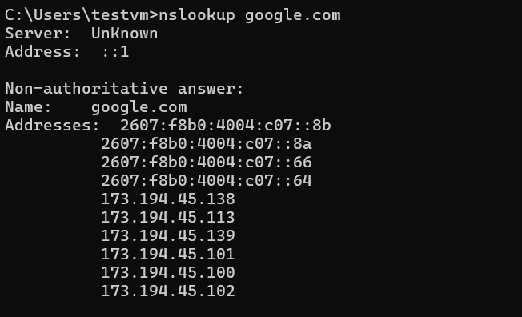
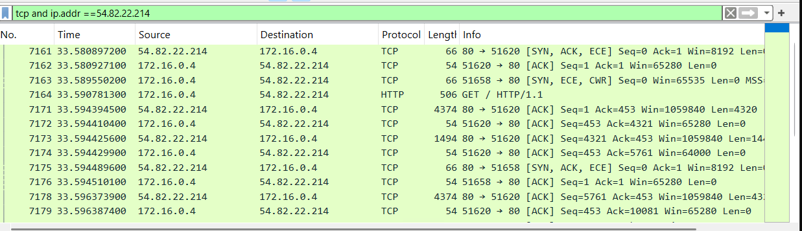
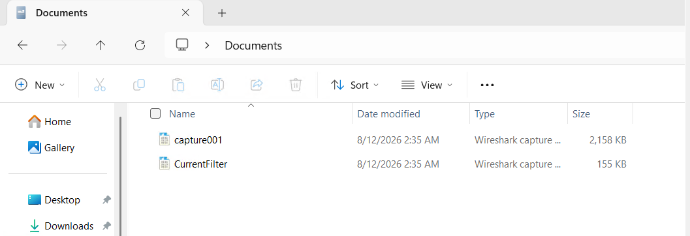

# Lab 02 --- Wireshark & Network Analysis

## Overview

This lab provided hands-on practice capturing and analyzing network
traffic with Wireshark. I worked through DNS resolution, TCP connection
establishment, HTTP traffic inspection, TCP stream reconstruction,
display filtering, and packet-capture file management.

The exercise demonstrates a core troubleshooting principle: when an
application, host, or service is not behaving as expected, packet-level
analysis can show what is actually happening on the network.

**Tools:** Wireshark 4.6.7, Windows Command Prompt\
**Environment:** Windows test VM / authorized lab environment\
**Cost:** \$0\
**Certification alignment:** CompTIA Network+, Security+, CySA+\
**Career relevance:** Network Engineering, SOC Analysis, Cloud Security,
Incident Response

------------------------------------------------------------------------

## Objectives

-   Capture live traffic from an active network interface.
-   Use Wireshark display filters to isolate relevant packets.
-   Generate and inspect a DNS lookup.
-   Identify DNS query and response data.
-   Analyze TCP connection behavior.
-   Inspect an HTTP POST request in an authorized test environment.
-   Follow a TCP stream to reconstruct a client/server conversation.
-   Save packet captures for later analysis.

------------------------------------------------------------------------

## Lab Walkthrough

### 1. Started a packet capture

I opened Wireshark and identified the active Ethernet interface by its
live traffic graph. Capturing on the correct interface is the first step
because Wireshark can only analyze traffic visible to the selected
network interface.


### 2. Generated a DNS lookup

With Wireshark capturing traffic, I ran:

``` text
nslookup google.com
```

The lookup returned both IPv6 and IPv4 addresses for `google.com`,
giving me known DNS activity to locate in the capture.



### 3. Filtered the capture for DNS traffic

I applied the display filter:

``` text
dns
```

This reduced the packet list to DNS queries and responses. In the
capture, the test VM (`172.16.0.4`) sent DNS traffic to the DNS server
(`168.63.129.16`).


I then expanded a DNS response and inspected the **Answers** section.
The response included AAAA records for `google.com`, demonstrating how
DNS maps a hostname to addresses that a system can use for network
communication.


**Takeaway:** Display filters make large packet captures manageable. DNS
analysis can help confirm name resolution and identify which addresses
were returned to a client.

------------------------------------------------------------------------

### 4. Examined TCP connection establishment

To isolate traffic for the HTTP test host, I filtered TCP traffic by IP
address:

``` text
tcp and ip.addr == 54.82.22.214
```

The capture shows TCP control traffic associated with establishing
connections between the test VM and the remote HTTP host, including
SYN/ACK and ACK packets.



The normal TCP three-way handshake is:

1.  **SYN** --- client requests a connection.
2.  **SYN-ACK** --- server acknowledges and accepts the request.
3.  **ACK** --- client confirms; the connection is established.

**Takeaway:** Handshake analysis is useful for distinguishing successful
connections from refused, reset, or unreachable services.

------------------------------------------------------------------------

### 5. Inspected cleartext data in an HTTP POST request

In the authorized lab environment, I submitted test credentials over
HTTP and applied:

``` text
http.request.method == POST
```

Wireshark exposed the form fields in the `HTML Form URL Encoded`
section, including the test username and password.


**Security finding:** HTTP does not provide TLS encryption. Sensitive
form data sent over plain HTTP can be visible to anyone who is
legitimately positioned to capture that traffic. This exercise
reinforced why authentication and other sensitive web traffic should use
HTTPS.

> **Note:** The credentials visible in this screenshot are lab-only test
> values and are not production credentials.

------------------------------------------------------------------------

### 6. Followed a TCP stream

I used **Follow → TCP Stream** to reconstruct the application-layer
conversation from individual packets. Wireshark displayed the HTTP
request from the client and the server's response as a single readable
exchange.


**Takeaway:** Individual packets provide fragments of a conversation.
Following a TCP stream makes it easier to understand the full
request/response sequence, which is valuable during troubleshooting and
incident investigation.

------------------------------------------------------------------------

### 7. Saved capture files

Finally, I saved my packet captures so they could be reopened and
analyzed later.



Saving `.pcapng` files preserves packet-level evidence and allows the
same traffic to be reviewed with different display filters without
recapturing it.

------------------------------------------------------------------------

## Display Filters Practiced

  Filter                          Purpose
  ------------------------------- --------------------------------------------
  `dns`                           Show DNS queries and responses
  `http`                          Show unencrypted HTTP traffic
  `tcp`                           Show TCP traffic
  `tcp.flags.syn == 1`            Find TCP SYN packets / connection attempts
  `tcp.flags.reset == 1`          Find TCP reset packets
  `icmp`                          Show ICMP diagnostic traffic
  `ip.addr == <IP>`               Isolate traffic to or from a host
  `tcp.port == 443`               Identify TCP traffic using port 443
  `http.request`                  Show HTTP requests
  `http.request.method == POST`   Isolate HTTP POST requests

------------------------------------------------------------------------

## What I Learned

This lab helped me move beyond viewing networking as an abstract set of
protocols. I was able to see DNS resolution, TCP connection behavior,
HTTP application data, and client/server conversations directly in
packet captures.

The biggest takeaways were:

-   DNS queries and responses can be isolated and validated at the
    packet level.
-   TCP flags reveal whether a connection is being established,
    acknowledged, reset, or left unanswered.
-   Wireshark display filters are essential for narrowing a busy capture
    to the traffic relevant to an investigation.
-   Plain HTTP can expose sensitive application data because the payload
    is not protected by TLS.
-   Following a TCP stream provides context that is difficult to get
    from individual packets alone.
-   Saving captures creates reusable evidence for troubleshooting,
    documentation, and further analysis.

------------------------------------------------------------------------

## Real-World Relevance

These skills transfer directly to technical roles where network
visibility matters:

-   **SOC Analyst:** investigate suspicious network activity and extract
    useful indicators.
-   **Cloud Security / IAM:** troubleshoot authentication or application
    connectivity by understanding DNS, TCP, and encrypted
    vs. unencrypted traffic flows.
-   **Systems / Network Administration:** determine whether a
    connectivity problem is related to DNS, connection establishment, or
    the application layer.
-   **Incident Response:** reconstruct network conversations to
    understand what occurred during an event.

------------------------------------------------------------------------

## Evidence

All screenshots in [`screenshots/`](./screenshots/) were captured while
I completed the lab in my authorized test environment.

> Packet capture files are intentionally not included in this starter
> repository package because only screenshots and the lab playbook were
> provided for documentation. They can be added later under a
> `captures/` directory if desired.

------------------------------------------------------------------------

## Source Lab

This portfolio entry was created from the **Lab 2 --- Wireshark &
Network Analysis** playbook used during the exercise. The lab focuses on
live capture, display filtering, DNS analysis, TCP handshakes, cleartext
HTTP inspection, TCP stream reconstruction, and capture-file management.
