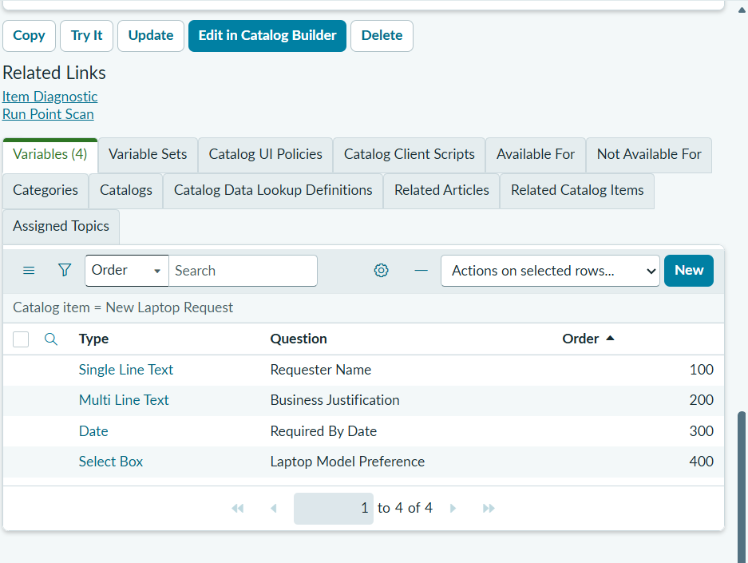
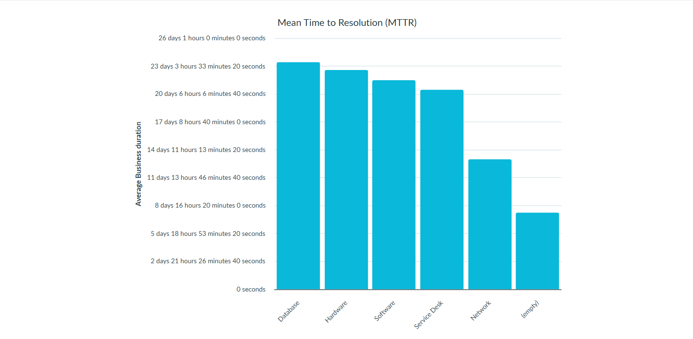

# Lab 3 — ServiceNow ITSM Implementation

A hands-on IT Service Management project built on a free ServiceNow Personal Developer Instance, covering the full incident lifecycle, service catalogue design, change management with approvals, and operational reporting — aligned with ITIL 4 Foundation and CompTIA A+/Network+ concepts.

## Overview

Enterprise IT teams don't handle problems ad hoc — they run them through a structured system that tracks, prioritizes, routes, and audits every request. This project recreates that system end-to-end in ServiceNow, one of the most widely deployed ITSM platforms in the world, to demonstrate practical readiness for IT support, sysadmin, and ITSM administrator roles.

## What This Project Covers

| Area | What Was Built |
|---|---|
| **Incident Management** | Created, triaged, and resolved a full incident lifecycle — including work notes, priority assignment, and resolution documentation |
| **Service Catalogue** | Designed a self-service "New Laptop Request" catalogue item with mandatory/optional variables and a fulfillment group |
| **Change Management** | Submitted a standard change request with risk/impact assessment, test/backout plans, and routed it through an approval workflow |
| **Reporting** | Built dashboards for incident volume by priority, Mean Time to Resolution (MTTR) by team, and open incidents by agent |

## Project Details

### 1. Incident Management
Simulated a real-world scenario: a user unable to access Outlook due to a corrupted profile. The ticket was:
- Logged with full caller, category, and priority details
- Assigned and moved through **New → In Progress → Resolved → Closed**
- Documented with internal work notes (staff-facing) and resolution notes (root cause + fix)

**Why it matters:** Incident handling is the core daily function of every help desk and support role. Proper documentation of root cause (not just symptoms) is what separates reactive fixing from professional IT support.

### 2. Service Catalogue Item
Built a "New Laptop Request" item with custom variables:
- Requester Name (required)
- Business Justification (required)
- Required By Date (required)
- Laptop Model Preference (optional, dropdown)

**Why it matters:** Service catalogues let end users self-serve routine requests without generating help desk tickets, directly reducing ticket volume and response time for higher-priority issues.

### 3. Change Management & Approval Workflow
Submitted a standard change (security patch deployment) including:
- Risk and impact classification
- CVE reference and CVSS score
- Scheduled maintenance window
- Test plan and backout plan
- Routed through the **Pending Approval → Scheduled** workflow

**Why it matters:** Unauthorized or uncoordinated changes to production systems are a leading cause of outages and security incidents. Change control is a foundational ITIL and risk-management practice.

### 4. Reporting & Metrics
Created three reports:
- Incident Volume by Priority (last 30 days)
- Mean Time to Resolution (MTTR) by Assignment Group
- Open Incidents by Assigned Agent

**Why it matters:** IT operations run on metrics. Being able to build and interpret SLA and performance reports is expected at every level, from analyst to manager.

## ITIL Concepts Applied

| Term | Definition | ServiceNow Module |
|---|---|---|
| Incident | Unplanned interruption to a service | Service Desk → Incidents |
| Problem | Root cause of one or more incidents | Service Desk → Problems |
| Change | Planned modification to infrastructure | Change → Changes |
| Service Request | User request for something new | Service Catalog |
| SLA | Committed response/resolution time | SLA → SLA Definitions |
| CMDB | Record of IT assets and relationships | Configuration → CIs |
| Knowledge Base | Documented known issues and fixes | Knowledge → Articles |

## Tools Used

- **ServiceNow Personal Developer Instance** (free, no credit card) — [developer.servicenow.com](https://developer.servicenow.com)
- ITIL 4 Foundation framework as the process reference

## Screenshots

*(Place these five screenshot files in this same folder for the images below to render.)*

### Incident Management

*Closed incident showing work notes and resolution notes together — full lifecycle from triage to root-cause fix.*

### Service Catalogue Item

*New Laptop Request catalogue item as it appears to end users in the self-service portal.*

*Variable configuration behind the New Laptop Request item — required/optional fields and the model preference dropdown.*

### Change Management & Approval

*Change request moved through approval to Scheduled state, with risk/impact and CVE details.*

### Reporting

*Mean Time to Resolution report, grouped by Assignment Group.*

## Skills Demonstrated

`ITSM` `ServiceNow Administration` `Incident Management` `Change Management` `ITIL 4` `Service Catalog Design` `IT Reporting & Metrics` `Root Cause Documentation`

## Certification Alignment

CompTIA A+ · Network+ · ITIL 4 Foundation

---

*This project was completed as part of a self-directed IT skills lab series focused on hands-on platform experience with enterprise tools.*
