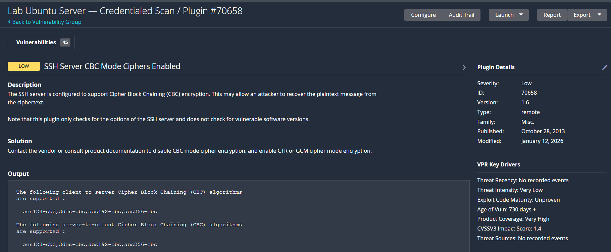

# Lab 4 — Nessus Vulnerability Scanning

A hands-on vulnerability management project using Nessus Essentials to perform network discovery scanning, credentialed vulnerability assessment, finding analysis, remediation, and verification — aligned with CompTIA Security+ and CySA+ concepts.

## Overview

Every network has vulnerabilities. The question isn't whether they exist — it's whether you find them before an attacker does. This project walks through the full vulnerability management lifecycle on a lab Ubuntu server: scanning for exposure, running an authenticated scan to see what an external scan misses, interpreting a real finding, applying a fix, and verifying the fix actually worked.

## What This Project Covers

| Area | What Was Built |
|---|---|
| **Discovery Scanning** | Ran an unauthenticated network scan to identify exposed hosts, ports, and services |
| **Credentialed Scanning** | Ran an authenticated scan against the same host, surfacing deep OS and configuration-level findings invisible to external scanning |
| **Finding Analysis** | Identified and interpreted a real SSH configuration weakness, including its CVSS severity, description, and recommended remediation |
| **Remediation** | Hardened the SSH server configuration by removing deprecated ciphers and MAC algorithms |
| **Verification** | Re-scanned the host and confirmed the vulnerability no longer appeared |

## Project Details

### 1. Discovery Scan
Ran a Basic Network Scan against the lab Ubuntu server with no credentials supplied — representing what an external attacker could see from outside the system: open ports, running services, and basic host fingerprinting.

**Why it matters:** Understanding what's visible from the outside is the starting point of any security assessment — it's the attacker's-eye view of the environment.

### 2. Credentialed Scan
Ran a second scan against the same host, this time authenticating directly to it. The credentialed scan surfaced significantly more detail — installed packages, SSH configuration settings, hardware/DMI information, and OS-level data that an unauthenticated scan cannot see.

**Why it matters:** Authenticated scans are the standard for internal vulnerability management because they inspect the system from the inside, finding configuration weaknesses and missing patches that external scanning alone would miss entirely.

### 3. Finding Identified: SSH Server CBC Mode Ciphers Enabled
The credentialed scan flagged that the SSH server was configured to support Cipher Block Chaining (CBC) encryption mode and weak MAC algorithms — a configuration that could allow an attacker to potentially recover plaintext from encrypted SSH traffic under certain conditions.

**Why it matters:** Being able to read a finding's description, understand its real-world risk, and know what a CVSS/severity rating actually means is the difference between running a scanner and being a security analyst.

### 4. Remediation
Updated the SSH daemon configuration (`/etc/ssh/sshd_config`) to remove CBC-mode ciphers and weak MAC algorithms, replacing them with modern, industry-recommended alternatives (AES-GCM, ChaCha20-Poly1305, and SHA-2 based MACs). Restarted the SSH service and verified continued remote access via a separate session before closing the original one.

**Why it matters:** Fixing a finding without breaking access to the system is a core operational skill — a fix that locks you out of a production server is not a successful fix.

### 5. Verification
Re-ran the credentialed scan against the same host and confirmed the SSH cipher and MAC findings no longer appeared, with zero residual Low, Medium, High, or Critical findings remaining.

**Why it matters:** Remediation verification closes the loop. A vulnerability isn't actually fixed until you've confirmed it with data, not assumption.

## Executive Summary

**Host Scanned:** Lab Ubuntu Server (18.191.67.239)
**Scan Type:** Credentialed Network Scan
**Tool:** Tenable Nessus Essentials

**Overview**
A credentialed vulnerability scan was performed against a lab Ubuntu server to assess its security posture. Credentialed scanning was used specifically because it authenticates directly to the host, allowing for deep inspection of installed software, configuration settings, and system-level security controls — providing significantly more visibility than an external, unauthenticated scan would.

**Findings**
The initial scan identified 47 total findings. The overwhelming majority were informational (system fingerprinting, installed software inventory, and open service detection) and did not represent active risk. One security-relevant finding was identified:

- **SSH Server CBC Mode Ciphers Enabled** *(Low severity)* — The SSH service was configured to support outdated Cipher Block Chaining (CBC) encryption modes and weak MAC algorithms. Under certain conditions, this configuration could allow an attacker positioned on the network to recover plaintext data from encrypted SSH sessions.

**Remediation**
The SSH daemon configuration was updated to remove support for CBC-mode ciphers and weak MAC algorithms, replacing them with modern, industry-recommended alternatives (AES-GCM, ChaCha20-Poly1305, and SHA-2 based MACs). The SSH service was restarted to apply the change, and connectivity was verified through a secondary session before the original session was closed — ensuring no loss of remote access during the change.

**Verification**
A follow-up credentialed scan was performed against the same host. The previously identified SSH cipher and MAC weaknesses no longer appeared in the results, confirming the remediation was successful. No residual Low, Medium, High, or Critical findings remained on the host following remediation.

**Business Impact**
This exercise demonstrates the complete vulnerability management lifecycle used in enterprise environments: identifying a real security weakness through authenticated scanning, applying an appropriate technical fix, and validating that the fix was effective — all without disrupting availability of the system.

## Portfolio Summary

During a credentialed Nessus scan of an Ubuntu server, I identified an SSH configuration vulnerability (CBC mode ciphers and weak MAC algorithms enabled), which could allow an attacker to potentially recover plaintext from encrypted SSH traffic. I edited the SSH daemon configuration to disable CBC ciphers and weak MACs, replacing them with modern GCM/CTR ciphers and SHA-2 based MACs, then restarted the SSH service. I verified the fix by re-running the credentialed scan and confirming both findings no longer appeared — completing the full discover-remediate-verify vulnerability management workflow.

## Severity Reference

| Severity | CVSS Range | What It Means |
|---|---|---|
| Critical | 9.0–10.0 | Remotely exploitable with little or no authentication. Fix immediately. |
| High | 7.0–8.9 | Significant impact if exploited. Fix within 7–14 days. |
| Medium | 4.0–6.9 | Requires conditions to exploit. Fix within 30 days. |
| Low | 0.1–3.9 | Minimal impact. Track and fix in routine patch cycles. |
| Info | 0 | Not a vulnerability — informational only. |

## Tools Used

- **Nessus Essentials** (free, up to 5 IPs) — [tenable.com/products/nessus/nessus-essentials](https://www.tenable.com/products/nessus/nessus-essentials)
- Ubuntu Server (AWS EC2) as the scan target

## Screenshots

### Discovery Scan

*Unauthenticated discovery scan showing open ports and services visible from outside the host.*

### Credentialed Scan

*Authenticated credentialed scan results, showing significantly deeper findings than the unauthenticated scan — including installed software, SSH configuration, and hardware details.*

### Finding Detail

*Detail view of the SSH Server CBC Mode Ciphers Enabled finding, including description, solution, and plugin output.*

### Verified Fix

*Post-remediation re-scan confirming zero results for the CBC cipher finding — the vulnerability has been successfully resolved.*

## Skills Demonstrated

`Vulnerability Management` `Nessus` `Credentialed Scanning` `CVSS` `SSH Hardening` `Linux Administration` `Remediation Verification` `Security Reporting`

## Certification Alignment

CompTIA Security+ · CySA+ · PenTest+

---

*This project was completed as part of a self-directed IT skills lab series focused on hands-on platform experience with enterprise security tools.*
